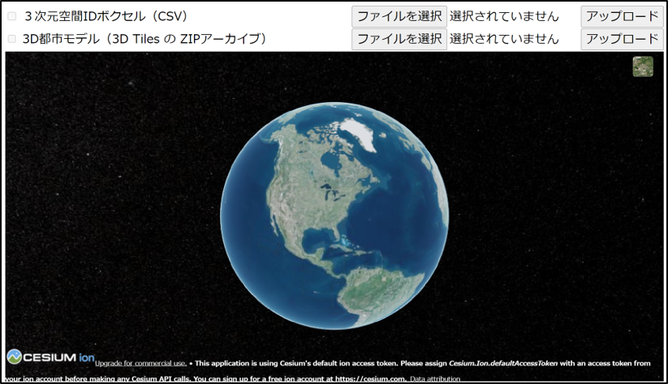

# 令和4年度　デジタル庁「デジタルツイン構築に向けた3D都市モデルの整備に関する調査研究」の成果物

## 概要

「3D都市モデル標準製品仕様書 第2.3版」準拠の3D都市モデルから「空間ID」を自動生成するためのツールです。

## 「PLATEAUのための空間ID生成ツール」について
令和4年度のデジタル庁「デジタルツイン構築に向けた3D都市モデルの整備に関する調査研究」において、人・機械が一意に空間を特定するための3次元グリッド（ボクセル）識別子である「空間ID」の実現・普及に貢献することを目的に、3次元の地理空間情報として中心的役割を担う「3D都市モデル」から「空間ID」を自動生成するツールを開発しました。
このツールは、二つのツールによって構成されています。
①空間IDを付与した3D都市モデル生成ツール：3D都市モデルに対し「空間ID」を自動付与するツール
②空間IDのメタデータ生成ツール：「空間ID」のメタデータに3D都市モデルの持つ属性情報を自動付与するツール

## 利用手順

### インストール方法

#### 事前準備

対応OSは以下の通りです。

- Windows
- macOS
- Linux

以下のソフトウェアをインストールしておいてください。

- Python 3.9
- Google Chrome または Microsoft Edge （ビューアを利用する場合）

#### コマンド部

空間IDを付与した3D都市モデル生成ツール、空間IDのメタデータ生成ツールのコマンド部のインストール手順は以下の通りです。

1. コマンドプロンプト（Windows）またはターミナル（macOS / Linux）を起動し、ツールのディレクトリに移動します。

    Windows の場合

        > cd command

    macOS / Linux の場合

        $ cd command

2. Python 仮想環境を作成し有効化します。

    Windows の場合

        > python -m venv .venv
        > .venv\Scripts\Activate

    macOS / Linux の場合

        $ python3 -m venv .venv
        $ source .venv/bin/activate

    ※ コマンド内の`.venv` は任意の名前に変更可能です。

3. Python 仮想環境に依存ライブラリをインストールします。

    Windows	の場合

        > pip install -r requirements.txt

	macOS / Linux の場合

    	$ pip install -r requirements.txt

#### ビューア部

空間IDのメタデータ生成ツールのビューア部のインストール手順は以下の通りです。

1. コマンドプロンプト（Windows）またはターミナル（macOS / Linux）を起動し、ツールのディレクトリに移動します。

    Windows の場合

        > cd web

    macOS / Linux の場合

        $ cd web

2. Python 仮想環境を作成し有効化します。

    Windows の場合

        > python -m venv .venv
        > .venv\Scripts\Activate

    macOS / Linux の場合

        $ python3 -m venv .venv
        $ source .venv/bin/activate

    ※ コマンド内の`.venv` は任意の名前に変更可能です。

3. Python 仮想環境に依存ライブラリをインストールします。

    Windows	の場合

        > pip install -r requirements.txt

	macOS / Linux の場合

    	$ pip install -r requirements.txt

### 使い方

#### 空間IDを付与した3D都市モデル生成ツール

1. コマンドプロンプト（Windows）またはターミナル（macOS / Linux）を起動し、ツールのディレクトリに移動します。

    Windows の場合

        > cd command

    macOS / Linux の場合

        $ cd command

2. Python 仮想環境を有効化します。

    Windows の場合

        > .venv\Scripts\Activate

    macOS / Linux の場合

        $ source .venv/bin/activate

3. CityGML から 地物ID（gml_id）と空間IDのペアリストを生成し CSV 出力します。

    Windows の場合

        > python citygml2id.py [コマンド引数]

    macOS / Linux の場合

        $ python citygml2id.py [コマンド引数]

    コマンド引数は以下の通りです。

    引数 | 説明 | 値 | デフォルト値
    --- | --- | --- | ---
    input_file_or_dir | CityGMLのファイルのパス（`*.gml`）または上位ディレクトリのパス | | |
    output_file_or_dir | 地物IDと空間IDのペアリストのファイルのパス（`*.csv`）または上位ディレクトリのパス | | |
    --lod | 処理するジオメトリの最大LOD | `1`, `2`, `3` | `3` |
    --grid-type | グリッドタイプ | `zfxy` | `zfxy` |
    --grid-level | グリッドのズームレベル | | `20` |
    --grid-size | グリッドのサイズ。x y z の順に指定。x のみ指定した場合は y z にも同じ値を適用。将来拡張用。 | | |
    --grid-crs | グリッドの座標参照系のEPSG番号。将来拡張用。 | | |
    --id | IDフィルタ。処理するデータを絞り込む際に gml:id の値を複数指定可能。 | | |
    --extract | 空間IDが付与された CityGML から、空間IDを抽出し、CSVへ出力する場合に指定。 | | |
    --extrude | ２次元データに付与する高さの最小値と最大値（単位：m）。--extract オプション指定時のみ有効。 | | |
    --interpolate | 立体（Solid）内側の空洞をボクセルで埋める場合に指定。Solid形状を持つ「Building（建築物）」「CityFurniture（都市設備）」「Vegetation（植生）」を空間IDに変換する際に使用するオプション。 | | |
    --merge | 上位の空間IDに統合（最適化）する場合に指定。 | | |
    --debug | デバッグログ出力および一時ファイル保持を有効にする場合に指定。 | | |
    -h | 使い方を表示。 | | |

4. CityGML および 地物ID（gml_id）と空間IDのペアリストから空間IDが付与されたCityGMLを生成します。

    Windows の場合

        > python id2citygml.py [コマンド引数]

    macOS / Linux の場合

        $ python id2citygml.py [コマンド引数]

    コマンド引数は以下の通りです。

    引数 | 説明 | 値 | デフォルト値
    --- | --- | --- | ---
    citygml_file_or_dir | CityGMLのファイルのパス(*.gml)または上位ディレクトリのパス | | |
    id_file_or_dir | 地物ID-空間IDペアリストのファイルのパス(*.csv)または上位ディレクトリのパス | | |
    output_file_or_dir | 空間IDを付与した CityGML のファイルのパス(*.gml)または上位ディレクトリのパス | | |
    --spatialid | 空間IDの付与方法　| `embedding`: CityGMLファイルに空間IDを直接付与   `reference`: 地物ID-空間IDペアリスト（CSVファイル）への相対パスを記録⇒CityGMLファイルへの空間IDの直接付与は行わず、外部ファイル参照のみで空間IDと紐付けする場合に使用   `both`: CityGMLファイルへの空間ID直接付与とCSVファイルへの相対パス記録の両者を実行 | `both` |
    -h | 使い方を表示 | | |

#### 空間IDのメタデータ生成ツール

##### コマンド部

1. コマンドプロンプト（Windows）またはターミナル（macOS / Linux）を起動し、ツールのディレクトリに移動します。

    Windows の場合

        > cd command

    macOS / Linux の場合

        $ cd command

2. Python 仮想環境を有効化します。

    Windows の場合

        > .venv\Scripts\Activate

    macOS / Linux の場合

        $ source .venv/bin/activate

3. 空間IDが付与された CityGML から 地物ID（gml_id）と空間IDのペアリストを CSV 出力します。

    Windows の場合

        > python citygml2id.py [コマンド引数]

    macOS / Linux の場合

        $ python citygml2id.py [コマンド引数]

    コマンド引数は以下の通りです。

    引数 | 説明 | 値 | デフォルト値
    --- | --- | --- | ---
    input_file_or_dir | CityGMLのファイルのパス（`*.gml`）または上位ディレクトリのパス | | |
    output_file_or_dir | 地物IDと空間IDのペアリストのファイルのパス（`*.csv`）または上位ディレクトリのパス | | |
    --lod | 処理するジオメトリの最大LOD | `1`, `2`, `3` | `3` |
    --grid-type | グリッドタイプ | `zfxy` | `zfxy` |
    --grid-level | グリッドのズームレベル | | `20` |
    --grid-size | グリッドのサイズ。x y z の順に指定。x のみ指定した場合は y z にも同じ値を適用。将来拡張用。 | | |
    --grid-crs | グリッドの座標参照系のEPSG番号。将来拡張用。 | | |
    --id | IDフィルタ。処理するデータを絞り込む際に gml:id の値を複数指定可能。 | | |
    --extract | 空間IDが付与された CityGML から、空間IDを抽出し、CSVへ出力する場合に指定。 | | |
    --extrude | ２次元データに付与する高さの最小値と最大値（単位：m）。--extract オプション指定時のみ有効。 | | |
    --interpolate | 立体（Solid）内側の空洞をボクセルで埋める場合に指定。Solid形状を持つ「Building（建築物）」「CityFurniture（都市設備）」「Vegetation（植生）」を空間IDに変換する際に使用するオプション。 | | |
    --merge | 上位の空間IDに統合（最適化）する場合に指定。 | | |
    --debug | デバッグログ出力および一時ファイル保持を有効にする場合に指定。 | | |
    -h | 使い方を表示。 | | |

##### ビューア部

※ 本ドキュメントでは開発サーバを用いた手順に限定します。運用環境では Apache や Nginx 等の Web サーバと mod_wsgi や uwsgi 等の WSGI 準拠ミドルウェアを組み合わせてデプロイすることを推奨いたします。

1. コマンドプロンプト（Windows）またはターミナル（macOS / Linux）を起動し、ツールのディレクトリに移動します。

    Windows の場合

        > cd web

    macOS / Linux の場合

        $ cd web

2. Python 仮想環境を有効化します。

    Windows の場合

        > .venv\Scripts\Activate

    macOS / Linux の場合

        $ source .venv/bin/activate

3. 開発サーバを起動します

    Windows の場合

    	> flask --app server run

    macOS / Linux の場合

        $ flask --app server run

4. Webブラウザでビューアのトップページを開きます。URLは以下の通りです。

    http://127.0.0.1:5000

    

5. データアップロード

    3D都市モデル、空間IDの順にアップロードします。

    

6. データ確認

    チェックボックスで3D都市モデルや空間IDの表示を切り替えることができます。

    

    3D都市モデルや空間ID（ボクセル）をクリックすると属性情報が表示されます。

    

    ※ 3D都市モデル、空間IDの順にアップロードした場合、空間IDのメタデータに3D都市モデルの属性情報が付与されます。

## ライセンス

* ソースコードおよび関連ドキュメントの著作権は国土交通省に帰属します。
* 本ドキュメントは[Project PLATEAUのサイトポリシー](https://www.mlit.go.jp/plateau/site-policy/)（CCBY4.0および政府標準利用規約2.0）に従い提供されています。

## 注意事項

* 本リポジトリは参考資料として提供しているものです。動作保証は行っておりません。
* 予告なく変更・削除する可能性があります。
* 本リポジトリの利用により生じた損失及び損害等について、国土交通省はいかなる責任も負わないものとします。

## 参考資料

* （近日公開）技術検証レポート: https://www.mlit.go.jp/plateau/libraries/technical-reports/
